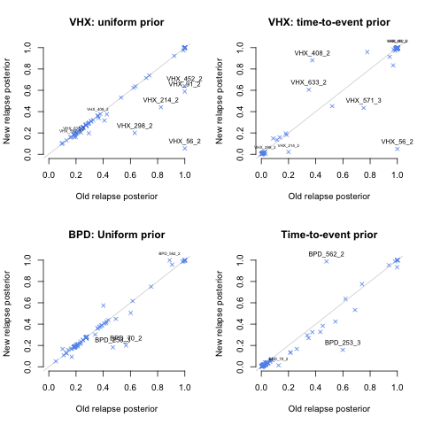

### Could-do: 
- This study needs updating to new code (e.g., plot_data) if it's going to be used. 
- make ColorPlot_MSdata legend representative of allele frequencies
- Plot an example of high posterior relapse that would be classified as reinfection using established methods

```{r markdwn_setup, include = FALSE}
knitr::opts_chunk$set(echo = FALSE)
library(knitr)
```

```{r R_setup, include = FALSE}
rm(list = ls())
library(Pv3Rs)
library(plyr)
source("~/Documents/RecurrentVivax/Genetic_Model/PlottingFunction.R") # Plotting function
load("~/Documents/RecurrentVivax/RData/GeneticModel/MS_data_PooledAnalysis.RData") # Genetic data
load("~/Dropbox/Vivax_VHXBPD_reanalysis/RData/Fake.RData") # For colour plot legend
load("~/Dropbox/Vivax_VHXBPD_reanalysis/RData/results_new.RData") # Load new results
load("~/Dropbox/Vivax_VHXBPD_reanalysis/RData/results_old_mean.RData")
load("~/Dropbox/Vivax_VHXBPD_reanalysis/RData/big_diff_eid_mean.RData")
load("~/Dropbox/Vivax_VHXBPD_reanalysis/RData/prior_estimates.RData")

# ==============================================================================
# Function to extract estimates for an episode ID
# ==============================================================================
get_estimates <- function(eid) {
  rbind("prior unnorm." = prior_unnorm[eid, ], 
        "prior norm." = prior[eid, ], 
        "old time-to-event" = old_TimeToEvent[eid, ], 
        "new time-to-event" = new_TimeToEvent[eid, ], 
        "old uniform" = old_Uniform[eid, ], 
        "new uniform" = new_Uniform[eid, ])
}


# ==============================================================================
# Extract marginal probabilities
# ==============================================================================
new_Uniform <- do.call(rbind, sapply(results_Uniform, function(x) x["marg"]))
new_TimeToEvent <- do.call(rbind, sapply(results_TimeToEvent, function(x) x["marg"]))

# ==============================================================================
# Extract marker ids and patient IDs
# ==============================================================================
mids <- tail(names(MS_pooled), 9) 
pids <- names(results_Uniform) 

# ==============================================================================
# Process patient IDs
# ==============================================================================
# Extract ids of patients with data on all markers
pids_9m_log <- sapply(pids, function(pid) { 
  all(!apply(MS_pooled[MS_pooled$ID %in% pid, mids], 2, function(x) all(is.na(x))))
})
pids_9m <- names(which(pids_9m_log)) # ids of patients with data on all markers

# Extract ids of patients with more than one recurrence
y.ids <- plyr::dlply(MS_pooled, 'ID')
pids_multirecur_log <- sapply(y.ids, function(x) length(unique(x$Episode)) > 3)
pids_multirecur <- names(which(pids_multirecur_log))

# Extract ids of patients with estimates that differ under new and old model
pids_big_diff <- apply(do.call(rbind, strsplit(big_diff_eid, "_"))[,1:2], 1, paste, collapse = "_")
```

# Unestimated

The new model was not used to estimate states for patients with evidence of more
than eight genotypes within and across infections. 

Data for which recurrent states are not directly estimatable: 

```{r}
ColorPlot_MSdata(rbind(MS_pooled[!MS_pooled$ID %in% pids, ],Fake), 
                 surpress_messages = T)
```
Total of `r length(unique(MS_pooled$ID[!MS_pooled$ID %in% pids]))` patients.
They appear to be mostly relapsing (zooming in on some interesting cases
identified by eye-balling the plot above):

```{r}
pids_no_est_exp <- c("VHX_225", "VHX_457", "VHX_475", "VHX_541", "VHX_554", "VHX_650", "BPD_150")
ColorPlot_MSdata(rbind(MS_pooled[MS_pooled$ID %in% pids_no_est_exp, ],Fake), 
                 surpress_messages = T)
```

\newpage

# Newly estimated

These are all estimated directly. That is to say, we didn't use the pairwise
hack used in Taylor & Watson et al. 2019.

Data for which recurrent states are directly estimated:

```{r }
ColorPlot_MSdata(rbind(MS_pooled[MS_pooled$ID %in% pids, ],Fake), 
                 surpress_messages = T)
```

All estimates have weight on either one or two states, excluding
reinfection-recrudescence (see simplex plots below). As such, the posterior
relapse probability is a sufficient summary statistic.


```{r, figures-side, fig.show="hold", out.width="50%"}
xy_u <- apply(new_Uniform, 1, project2D)
xy_t <- apply(new_TimeToEvent, 1, project2D)

plot_simplex(v_labels = colnames(new_Uniform))
points(x = xy_u["x",], xy_u["y",], pch = 20)
title(main = "Uniform prior")

plot_simplex(v_labels = colnames(new_TimeToEvent))
points(x = xy_t["x",], xy_t["y",], pch = 20)
title(main = "Time-to-event prior")
```

New estimates were generated for all BPD patients with paired data, allowing
direct comparison between the computation of the BPD failure rate using the old
and new genetic models --- basically the same (see
Compute_PQ_failure_rates_new.R).

The new model generates estimates for patients whose genetic data were not
analysed under the old model of Taylor & Watson et al. 2019:

```{r}
pids_ommited <- c("VHX_461", "VHX_39","VHX_52","VHX_239")  
ColorPlot_MSdata(rbind(MS_pooled[MS_pooled$ID %in% pids_ommited, ], Fake), 
                 surpress_messages = T)
```

Episodes with data on nine markers look like relapse because more than three markers were typed only if the first three markers did not discriminate... 

For patients with only one recurrence: 

```{r}
ColorPlot_MSdata(rbind(MS_pooled[MS_pooled$ID %in% # Only one recurrence
                                   setdiff(pids_9m, pids_multirecur), ],Fake), 
                 surpress_messages = T) 
```

For patients with more than one recurrence: 

```{r}
ColorPlot_MSdata(rbind(MS_pooled[MS_pooled$ID %in% # More than one recurrence
                                   intersect(pids_9m, pids_multirecur), ],Fake), 
                 surpress_messages = T)
```

Some cherry picked examples, including 

- VHX_532 (an example of half sibs with a high posterior relapse probability)
- BPD_45 (a rare example of a possible reinfection with data on nine markers)

```{r}
pids_ex <- c("VHX_622", # Example of alternating relapses
             "VHX_532", # Example of half sibs
             "BPD_45")  # Rare example of reinfection
ColorPlot_MSdata(rbind(MS_pooled[MS_pooled$ID %in% pids_ex, ],Fake), 
                 surpress_messages = T)
```

```{r}
kable(get_estimates("VHX_532_5"), caption = "Estimates for VHX_532_5")
kable(get_estimates("BPD_45_2"), caption = "Estimates for BPD_45_2")
```

\newpage

# Comparing the new and old model 

Some new and old relapse probability estimates differ a lot: 

{#id .class width=50% height=50%}

Data for which estimates differ a lot: 

```{r}
ColorPlot_MSdata(rbind(MS_pooled[MS_pooled$ID %in% pids_big_diff, ],Fake), 
                 surpress_messages = T)
```

## Examples where change is undersirable: 

Based on the genetic data VHX_56_2 and VHX_91_2 look like relapses, but with
half-siblings across infections at odds with full siblings within infections: 

```{r}
pids_neg <- c("VHX_56", # PV.3.27 error and PV.ms8 half sib
              "VHX_91") # PV.ms8 error 
ColorPlot_MSdata(rbind(MS_pooled[MS_pooled$ID %in% pids_neg, ],Fake),
                 surpress_messages = T)
kable(get_estimates("VHX_56_2"), caption = "Estimates for VHX_56_2")
kable(get_estimates("VHX_91_2"), caption = "Estimates for VHX_91_2")
```

If state probabilities are re-estimated without using the data on PV.ms8, we recover 
high posterior relapse: 

```{r}
# And if we drop PV.ms8? 
y.dfs <- dlply(MS_pooled[MS_pooled$ID %in% pids_neg, ], 'ID') # Group genetic data by patient ID
load('~/Documents/RecurrentVivax/RData/Data_for_relatedness.RData') # Allele frequencies (FS_combined)
MSs_all <- names(Fs_Combined) # Extract genetic marker names
# Re-estimate state probabilities without PV.ms8 
est_without_ms8 <- do.call(rbind, sapply(1:2, function(i) {
  
  y.df <- y.dfs[[i]]  
  
  # only use markers for which there is at least one non-NA
  ms <- MSs_all[apply(!is.na(y.df[MSs_all]), 2, any)]
  ms <- ms[!ms %in% "PV.ms8"]
  
  # transform data frame format to format taken by 'compute_posterior'
  y.by.episode <- dlply(y.df, 'Episode_Identifier')
  
  # Format data for compute_posterior
  y <- lapply(y.by.episode, function(episode) {
    setNames(lapply(ms, function(m) {
      alleles <- episode[m][!is.na(episode[m])] # extract non-NAs
      if (length(alleles) > 0) {
        return(alleles) }
      else {
        return(NA) # if all are NAs, change empty vector to NA  
      }
    }), ms)
  })
  
  # Store result in a list
  compute_posterior(y, Fs_Combined)$marg
}))

est_without_ms8 # Re-establish high relapse probability
```

## Example where change is beneficial: 

```{r}
ColorPlot_MSdata(rbind(MS_pooled[MS_pooled$ID %in% "BPD_562", ],Fake), 
                 surpress_messages = T)
kable(get_estimates("BPD_562_2"), caption = "Estimates for BPD_562_2")
```

Based on the genetic data, BPD_562_2 looks like a relapse (5 of 4 markers have some homologous alleles) and has a high probability of being a relapse. However, the timing of BPD_562_2 suggests it's a reinfection. Under the new model, the posterior deviates more from the prior. 


